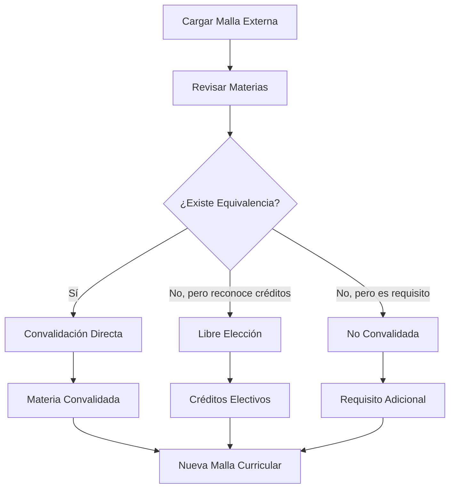

# 🆕 Nueva Funcionalidad: Materias No Convalidadas (Materias Adicionales)

## 📋 Descripción

Se ha agregado una nueva opción de convalidación llamada **"No Convalidada (Materia Adicional)"** que permite marcar materias externas como **requisitos adicionales** para estudiantes que migren a la nueva malla curricular.

## 🎯 ¿Qué significa "No Convalidada"?

Una materia marcada como **"No Convalidada"** significa que:

- ✅ **No se convalida** con ninguna materia existente en la malla actual
- ✅ **Se convierte en un requisito adicional** para los estudiantes migrantes
- ✅ **Forma parte de la nueva malla curricular** modificada
- ✅ **Debe ser cursada obligatoriamente** por los nuevos estudiantes

## 🚀 Casos de Uso

### **Ejemplo 1: Actualización Curricular**
Una universidad decide que todos los nuevos estudiantes deben cursar **"Ética Profesional"** como requisito adicional, pero esta materia no existe en la malla actual.

**Solución**: Marcar "Ética Profesional" como **"No Convalidada"**

### **Ejemplo 2: Nuevos Estándares**
Se requiere que los estudiantes tengan conocimientos en **"Ciberseguridad Avanzada"** que no estaba en el plan de estudios original.

**Solución**: Marcar "Ciberseguridad Avanzada" como **"No Convalidada"**

## 🔧 Cómo Usar la Nueva Funcionalidad

### **Paso 1: Acceder al Sistema de Convalidaciones**
1. Navegar a **Convalidaciones** en el menú principal
2. Seleccionar una malla curricular externa

### **Paso 2: Configurar una Materia como "No Convalidada"**
1. Hacer clic en **"Configurar"** (⚙️) en la materia deseada
2. Seleccionar **"No Convalidada (Materia Adicional)"**
3. Agregar notas explicativas (opcional)
4. Guardar la configuración

### **Paso 3: Visualizar el Impacto**
- La materia aparecerá marcada con icono **🔴** y badge **"Materia Adicional"**
- Las estadísticas mostrarán la cantidad de **"Materias Adicionales"**
- El análisis de impacto incluirá los créditos adicionales requeridos

## 🎨 Indicadores Visuales

| Tipo | Icono | Color | Descripción |
|------|-------|-------|-------------|
| **Convalidación Directa** | ➡️ | Verde | Equivale a materia específica |
| **Libre Elección** | ⭐ | Azul | Créditos electivos |
| **No Convalidada** | ➕ | Naranja | Materia adicional requerida |
| **Sin Configurar** | ⏳ | Gris | Pendiente de configuración |

## 📊 Impacto en Estadísticas

### **Nuevas Métricas Incluidas:**
- **Materias Adicionales**: Cantidad de materias no convalidadas
- **Créditos Adicionales**: Total de créditos extra requeridos
- **Estudiantes Afectados**: Análisis de carga académica adicional

### **Dashboard Actualizado:**
```
┌─────────────────┬─────────────────┬─────────────────┬─────────────────┐
│ Convalidaciones │ Libre Elección  │ Mat. Adicionales│ Sin Configurar  │
│ Directas        │                 │                 │                 │
│ 🟢 15           │ 🔵 8            │ 🟠 4            │ ⚪ 3            │
└─────────────────┴─────────────────┴─────────────────┴─────────────────┘
```

## 💡 Beneficios

### **Para Administradores Académicos:**
- 📈 **Planificación precisa** de nuevas mallas curriculares
- 🎯 **Control granular** sobre requisitos adicionales
- 📋 **Documentación clara** de cambios curriculares
- 📊 **Análisis de impacto** completo

### **Para Estudiantes:**
- 🔍 **Transparencia total** sobre requisitos adicionales
- 📝 **Planificación académica** más precisa
- ⏰ **Estimación realista** de tiempo de graduación
- 📚 **Conocimiento claro** de materias obligatorias

## 🔄 Flujo de Trabajo



## 🧪 Datos de Prueba

El sistema incluye datos de ejemplo que demuestran la funcionalidad:

- **Ética Profesional** (2 créditos) - Semestre 2
- **Gestión de Proyectos** (3 créditos) - Semestre 6  
- **Seguridad Informática Avanzada** (4 créditos) - Semestre 8
- **Innovación y Emprendimiento** (3 créditos) - Semestre 9

**Total**: 12 créditos adicionales requeridos

## 🚀 Próximos Pasos

Con esta funcionalidad implementada, el sistema ahora permite:

1. ✅ **Convalidación completa** de mallas curriculares
2. ✅ **Planificación precisa** de requisitos adicionales
3. ✅ **Análisis de impacto** comprehensivo
4. ✅ **Gestión integral** de migraciones académicas

---

**Implementado**: Julio 30, 2025  
**Versión**: 1.0  
**Estado**: ✅ Funcional y Probado
